# SPRING PLUS
## AWS 서비스 구성

### 1. EC2 인스턴스 설정
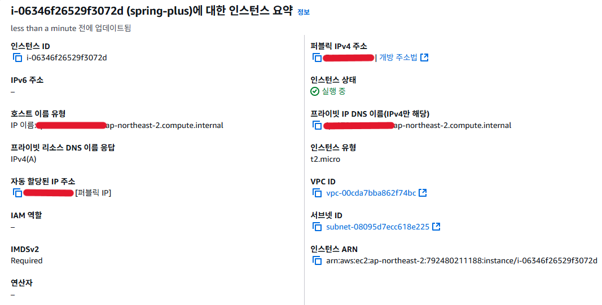

### 2. 탄력적 IP 연결 확인
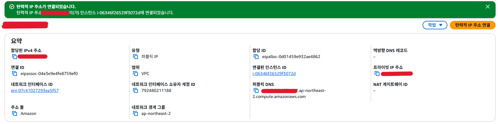

### 3. Health Check API 작동 확인
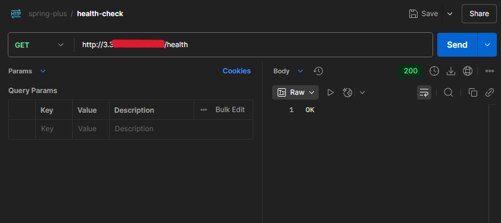

### 4. RDS 연결 설정 (application.properties 설정)
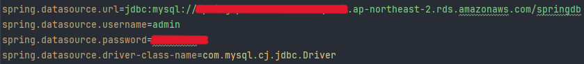

### 5. DB 테이블 목록 및 Hibernate 로그

* DB 툴에서 테이블 생성 확인
  
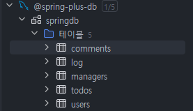

* Hibernate 콘솔 로그 (EC2)
  
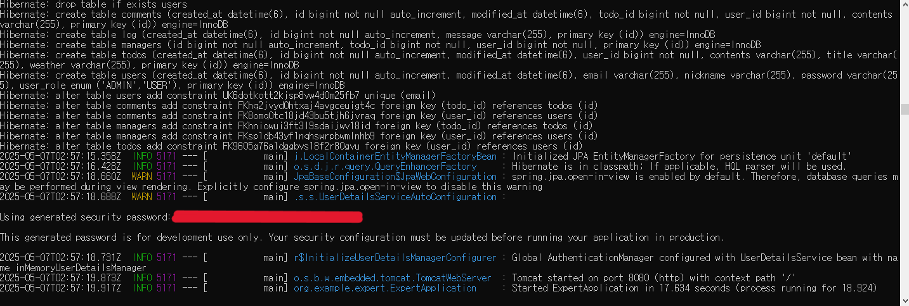

### 6. 보안 그룹 인바운드 설정
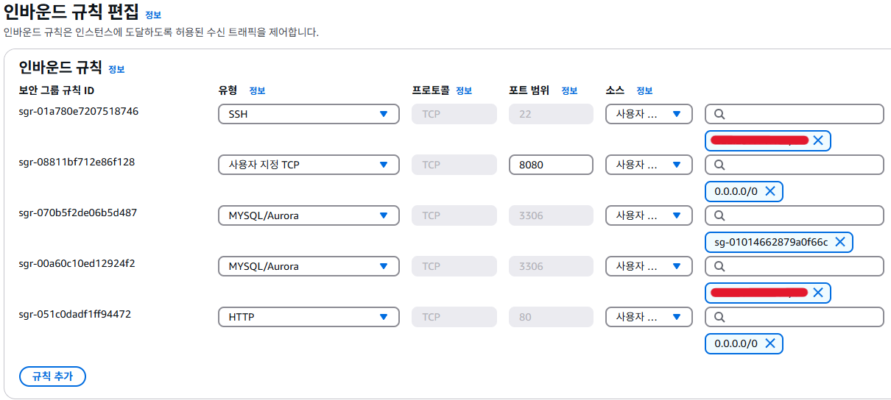

### 7. S3 버킷 정책 및 퍼블릭 엑세스 설정
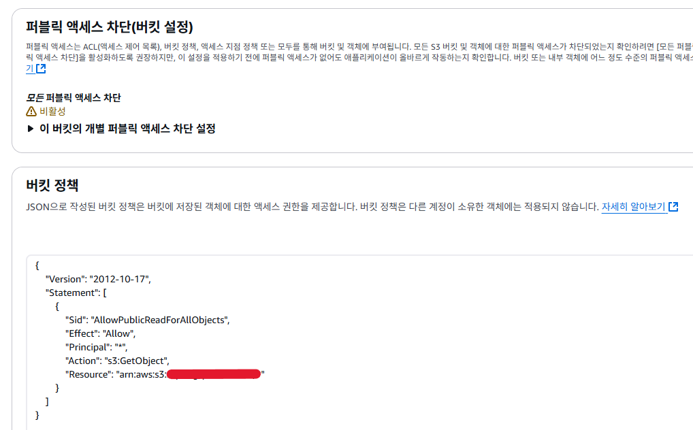

### 8. Swagger API 테스트 (프로필 이미지 업로드)
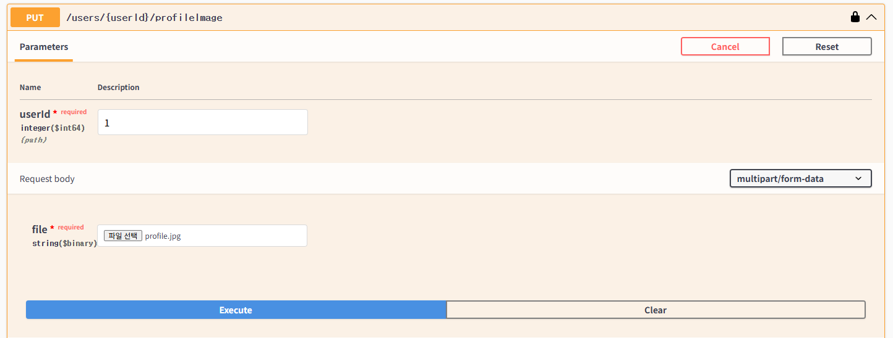

### 9. S3에 업로드된 이미지 확인
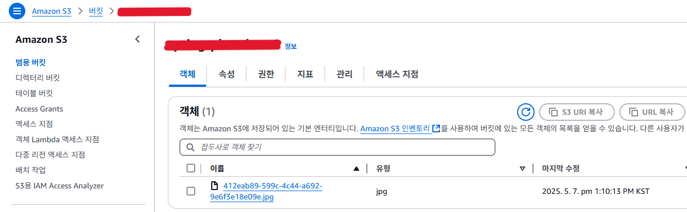

### 10. DB에 저장된 이미지 URL 확인
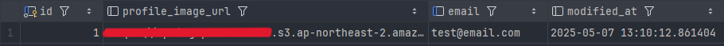

### 11. S3 이미지 URL 웹 접근 테스트

 

## 유저 데이터 100만 건 조회 테스트 결과

### 성능 비교 그래프
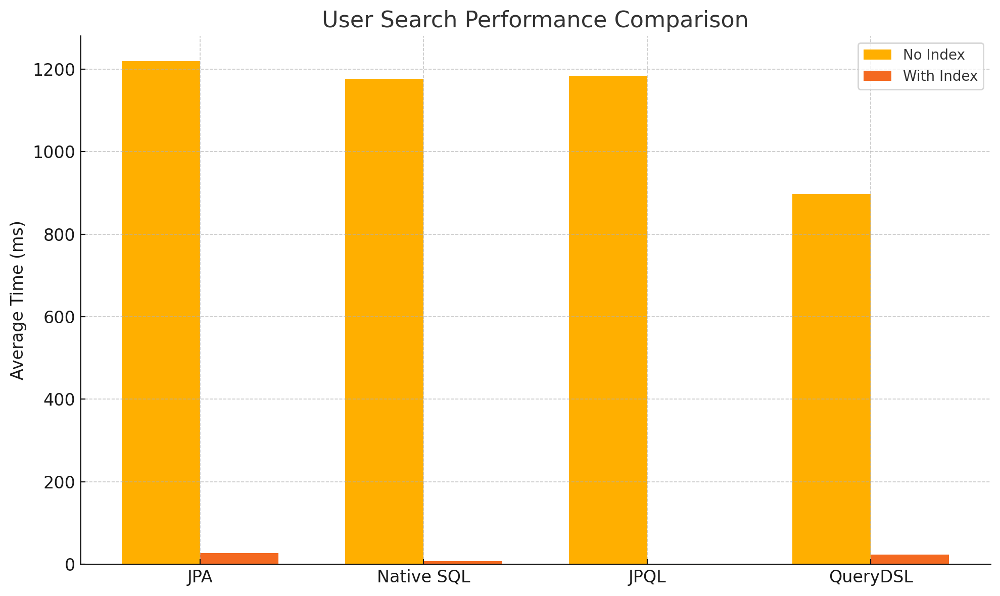

### 평균 실행 시간 (10회 기준)
| Query Method | No Index (ms) | With Index (ms) |
|--------------|---------------|-----------------|
| JPA          | 1220          | 27              |
| Native SQL   | 1177          | 8               |
| JPQL         | 1184          | **2**           |
| QueryDSL     | **898**       | 24              |

